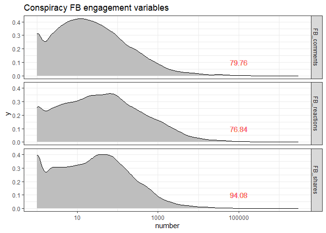
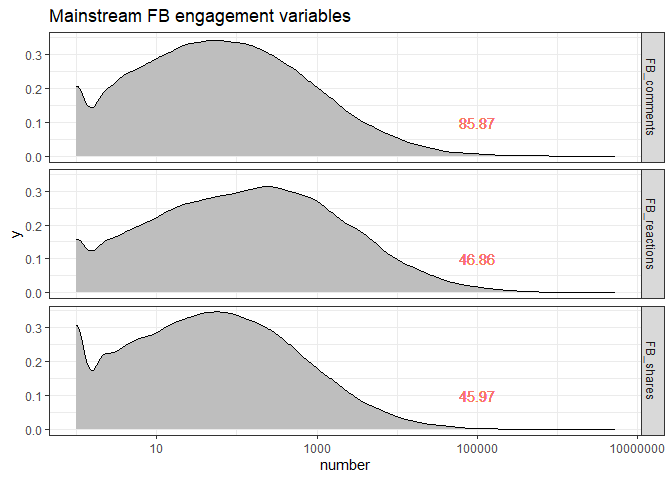
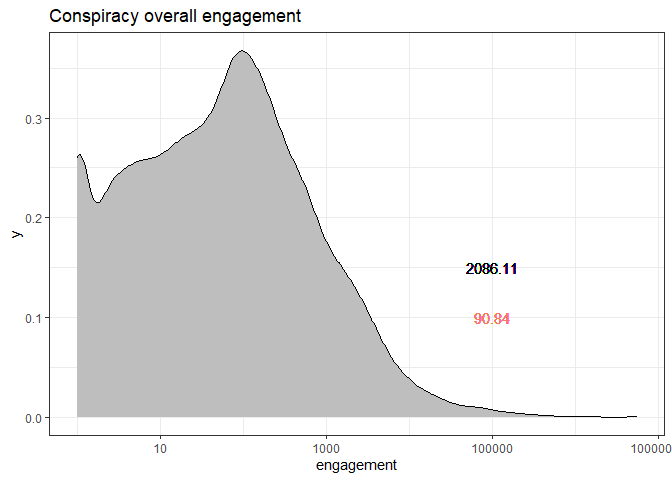
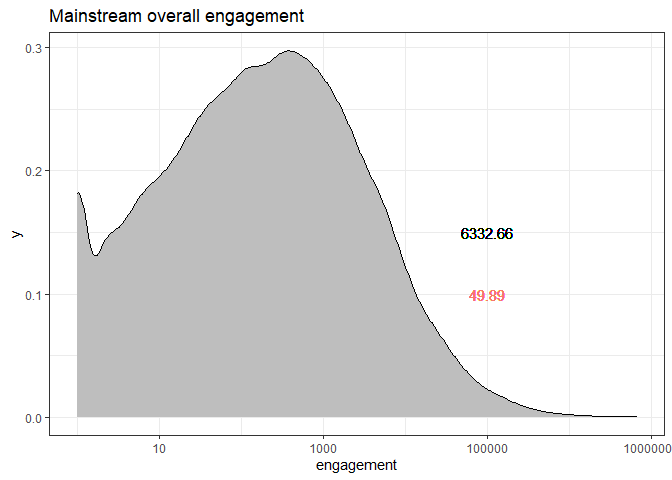
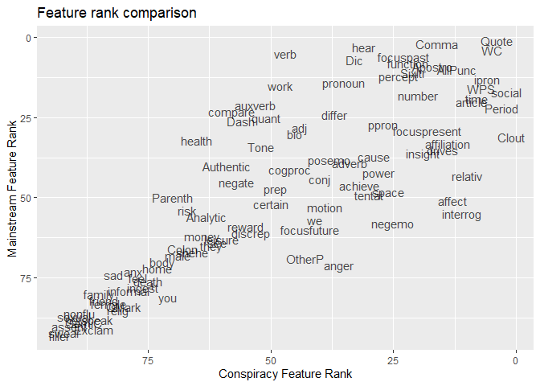
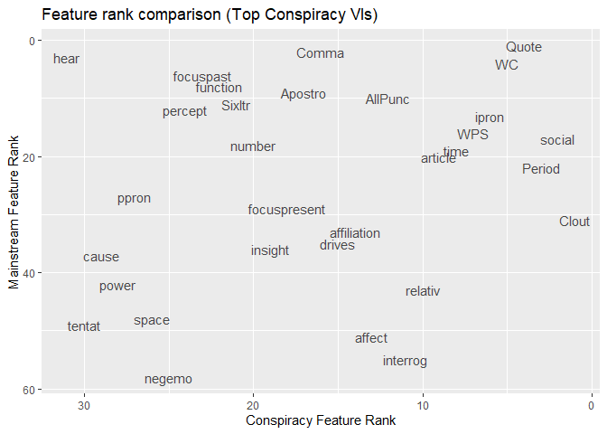
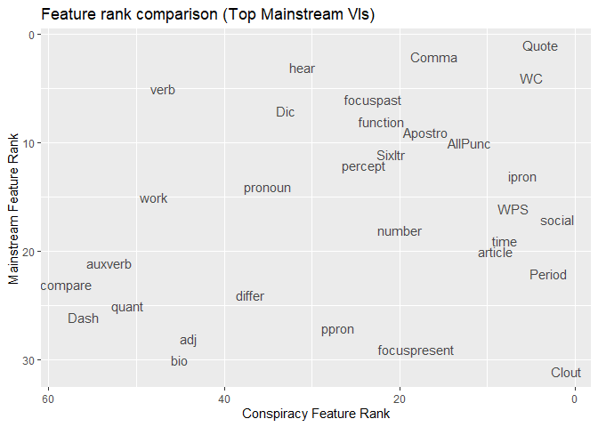
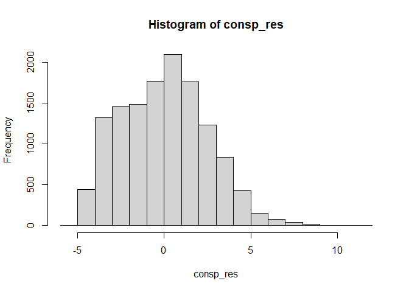
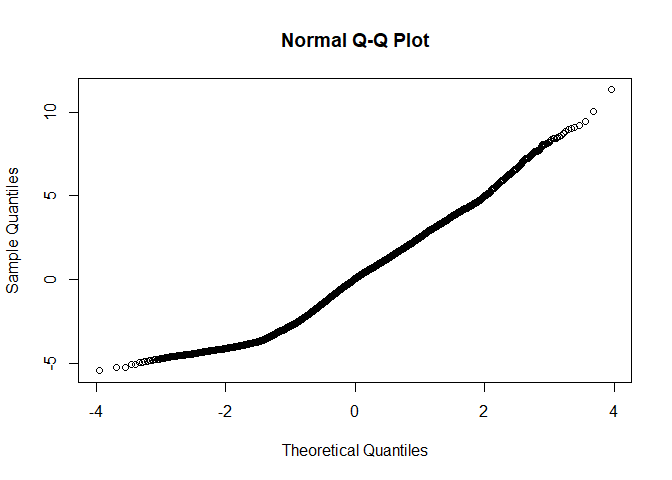
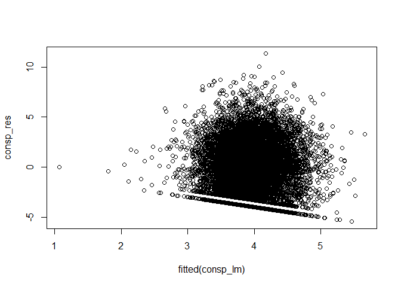

```{r setup, include=FALSE}
knitr::opts_chunk$set(echo = TRUE)
```

## Background

Conspiracy theories are narratives that attempt to explain significant social events as being secretly plotted by powerful elites or organizations at the expense of an unwitting population to achieve some (usually sinister) goal. Belief in such theories is widespread, with over 50% of the United States population believing in at least one in 2013 (Oliver & Wood, 2014). Even more people passively endorse conspiracy theories, assenting to one or more conspiracy-related beliefs if asked, reflecting a general suspicion of the powerful. The internet is a major contributor to the rapid spread of CTs in the modern day, as it allows anyone to produce, share, and consume content with few editorial filters. Belief in CTs is correlated to rejection of official information and science, detrimental or lack of social action, general distrust and political alienation, justification for engaging in crime, and anti-Semitic and Islamophobic attitudes, among others. Thus far, much research on the circulation of CTs has focused on psychological factors which explain why particular individuals find conspiracy theories attractive. However, complementary research must investigate the content of CT narratives in order to better understand their spread, as CT _beliefs_ do not spread per se, but rather, CTs spread as materialized narratives. 

## Research questions

Therefore, using the publicly available language of conspiracy (LOCO) corpus, this project utilizes data-intensive methods to investigate the following: Which lexical features of documents that are considered conspiratorial have the strongest influence on social media engagement? Does this differ from the LFs that influence social media engagement with documents that are non-conspiratorial? It is hypothesized that LFs identified by previous research and by the authors of the LOCO itself as prototypical conspiratorial language, such as emotional language, hostility, and interrogation will have increased engagement on Facebook. In addition, since conspiracism has its basis in disbelieving a mainstream, often reflected in its style and argumentation, the LFs that correlate with engagement on mainstream documents are likely to differ. 

## Data: Language of Conspiracy (LOCO) Corpus

LOCO is an 88-million-token corpus that consists of topic-matched conspiracy (n= 23,937) and mainstream (n= 72,806) documents harvested from 150 websites. The corpus is licensed under an open access Creative Commons license, permitting use, sharing, adaptation, distribution and reproduction in any medium or format, allowing every aspect of this research project to be shared. The corpus is annotated with a rich set of linguistic features (n= 287) and contains extensive metadata, including Facebook shares, reactions, and comments, which are central to this analysis. LOCO and its related datasets are large (over 1 GB) and hierarchically structured, so various methods were utilized to import ([see data_import.md](data/data_import.md)) and tidy ([see data_wrangling.md](data/data_wrangling.md)) the corpus into smaller, rectangular data frames that are a more workable format for analysis in R studio. LOCO’s authors used two tools to extract the lexical features of the documents: Linguistic Inquiry and Word Count (LIWC) and Empath. Due to the large number of features extracted by the authors (n= 287), only the LIWC features will be used for this particular analysis. While both tools have been used previously to investigate the language of conspiracy on social media, LIWC is human-coded, has fewer categories to work with (n= 93) which will likely reduce co-variance, and includes grammatical categories while Empath operates solely as a proxy for sentiment analysis.

## Analysis

To view a step-by-step walkthrough of the data analysis, see [analysis_walkthrough.md](data/analysis_walkthrough.md).

### Engagement variables

In order to begin analysis, density plots of the Facebook engagement variables (comments, shares, and likes) were generated for the conspiracy and mainstream subcorpora. Even when filtering out documents with n= 0 in these variables, the plots demonstrated a strong positive skew, indicating that engagement metrics are not normally distributed. That is, the majority of documents, whether mainstream articles or conspiratorial in nature, receive very few shares, reactions, or comments, while very few documents receive much larger numbers of these types of engagements. The x-axis was scaled logarithmically in order to better visualize the distribution. It appears that the engagement patterns for conspiratorial and mainstream documents are quite similar for their respective metrics, though the conspiracy texts have higher skewness scores (indicated by red text on the plots below) overall. 





Following this visualization, the shares, reactions, and comments variables were concatenated to create an overall engagement variable. The reasoning for this overall indicator is that social media sites such as Facebook use algorithms that take comments and reactions into account when deciding what users will see on their feed. If a user shares a link to a site and gains multiple comments and reactions, this share will ultimately gain more visibility compared to a shared post with 0 comments or reactions. The density plots below visualize the overall engagement scores, mean engagement (in black), and skewness (in red). 





### Implementing random forests

Due to the large number of lexical features to consider, a random forest was trained for both the conspiracy and mainstream subcorpora. A random forest is a machine-learning technique that generates an ensemble of decision trees to make predictions based on data. This method provides variable importance (VI) scores that describe predictive power. Variables with higher importance are the drivers of the outcome, while variables with low importance might be omitted from a model. The scatterplot below compares the VI of LIWC features in predicting overall engagement of conspiracy versus mainstream documents. 



Overall, the plot demonstrates a _weak_ positive correlation between the LIWC feature VI rankings on engagement in the mainstream and conspiracy subcorpora. However, when considering only the variables with the strongest predictive power on engagement in conspiratorial texts, there appears to be little to no correlation in ranking with the features in mainstream documents, and vice versa. 





The LIWC variables consist of various categories, including summary language variables (such as emotional tone, word count, analytic thinking), linguistic dimensions (such as function words, pronouns, interrogatives), and psychological processes (such as affective processes, perceptual processes, drives). A primary distinction between subcorpora appears to be that the LIWC variables with the strongest VI for mainstream documents almost entirely concern text features or linguistic dimensions such as quotes, commas, word count, verbs, function words, and so on. While conspiracy documents share some of these top predictors, variables more closely related to psychological processes receive considerably higher VI scores. Some prominent examples of LIWC features with notably higher VI for conspiratorial texts include clout, social, affect, affiliation, and drives. Clout, the most important feature driving engagement with conspiratorial texts based on this random forest, refers to the relative social status, confidence, or leadership that people display through their writing or talking. The social variable, which closely follows clout in variable importance, measures social processes and includes a large group of words that denote these, including non-first person-singular personal pronouns and verbs that suggest human interaction (such as talking, sharing). For interpretation of other variables, the LIWC variable information table from the development manual is [included in a pdf as a reference](data/LIWC_guide.pdf). 

### Fitting a linear model 

Following the analysis of variable importance of LIWC features on Facebook engagement, variables of interest were selected to fit a linear model. The variables were selected based on two criteria: (1) high variable importance and (2) connection to conspiratorial language based on previous literature. For example, interrogatives and negative emotion features are included due to research indicating that conspiracist ideation is characterized by challenging the mainstream and distrust of the institutions of society at large. The selected variables are outlined in a table below.

| Variable name | Category             | Example language      |
|---------------|----------------------|-----------------------|
| clout         | Clout                | -                     |
| social        | Social processes     | mate, talk, they      |
| ipron         | Impersonal pronouns  | it, it's, those       |
| time          | Time                 | end, until, season    |
| relativ       | Relativity           | area, bend, exit      |
| interrog      | Interrogatives       | how, when, what       |
| affect        | Affective processes  | happy, cried          |
| affiliation   | Affiliation          | ally, friend, social  |
| drives        | Drives               | success, win, benefit |
| focuspresent  | Present focus        | today, is, now        |
| insight       | Insight              | think, know           |
| focuspast     | Past focus           | ago, did, talked      |
| percept       | Perceptual processes | look, heard, feeling  |
| negemo        | Negative emotion     | hurt, ugly, nasty     |
| space         | Space                | down, in, thin        |
| ppron         | Personal pronouns    | I, them, her          |
| power         | Power                | superior, bully       |
| cause         | Causation            | because, effect       |
| tentat        | Tentative            | maybe, perhaps        |
| hear          | Hear                 | listen, hearing       |

The first linear model constructed based on these variables yielded an R-squared score (measure of goodness of fit or model accuracy) of 0.2148 and adjusted R-squared score of 0.01999, showing a low correlation between the selected variables and the engagement variables. However, certain coefficients demonstrated higher p-values than others and reached statistical significance, suggesting a relationship between certain variables observed in the model also exist in the larger population. Highly significant LIWC lexical features included clout, social, interpersonal pronouns, affiliation, personal pronouns, power, and causation. Assumptions of normality and collinearity were checked using a histogram of the residuals, which was slightly positively skewed, a Q-Q plot, and a scatter plot of the residuals and fitted values, shown below. 






The skew of the histogram and the distribution of the residuals and fitted values shows that this linear model does not really meet the normality assumption for linear regression, which is unsurprising, considering the positive skew present in the data when it comes to both engagement and various LIWC feature scores. The variance inflation factors (VIFs) were also checked to ensure there was no collinearity between the variables. Based on this model, a few variables with high VIFs were removed from the model. Even so, the resulting model did not improve, with the R-squared scores actually decreasing. Other statistical methods that do not rely on a normal distribution might be better suited to dealing with this data and provide additional insights.  

## Process reflection

The extensive data and annotation and incredible hierarchal organization of the LOCO corpus by its authors made working with the data for this project a smooth, straightforward process. However, there were some hiccups involving the scale of the data being too large for github, and the repo had to be cloned to remove the oversized files from the commit history. Mastering version control and good data habits was a major stepping stone throughout this project. In addition, the excellent work that the LOCO corpus's authors have done was something of a double-edged sword. Because the authors annotated the corpus so extensively and explored it from many angles and with many methods, it made it challenging to figure out how to add value to the data through my own analysis. Overall, while this analysis was in many ways similar to some previous work surrounding the language of conspiracy and its spread across social media, I believe it does provide a unique perspective and offer new insights, primarily regarding the "clout" feature and the potential differences in lexical features that have an influence on engagement between topic-matched conspiracy and mainstream texts. There are many opportunities for continued analysis and deeper inquiry based around individual lexical features and the documents included in the LOCO corpus based on this project.

## References and further reading

Klein, C., Clutton, P., & Dunn, A. (2019). Pathways to conspiracy: The social and linguistic precursors of involvement in 	Reddit’s conspiracy theory forum. _PLOS ONE_. 14(11): e0225098. 10.1371/journal.pone.0225098 

Miani, A., Hills, T., & Bangerter, A. (2022). LOCO: The 88-million-word language of conspiracy corpus. _Behavior research 	methods_, 54(4), 1794–1817. https://doi.org/10.3758/s13428-021-01698-z

Mompelat et al. (2022). How “Loco” is the LOCO corpus? Annotating the language of conspiracy theories. In _Proceedings 	of the 16th Linguistic Annotation Workshop (LAW-XVI) within LREC2022_, 111–119. European Language Resources Association

Oliver, J. E., & Wood, T. J. (2014). Conspiracy Theories and the Paranoid Style(s) of Mass Opinion. _American Journal of Political Science_, 58(4), 952–966. https://doi.org/10.1111/ajps.12084

Wood, M. & Douglas, K. (2015). Online communication as a window to conspiracist worldviews. _Frontiers in Psychology_. 6. 10.3389/fpsyg.2015.00836. 


